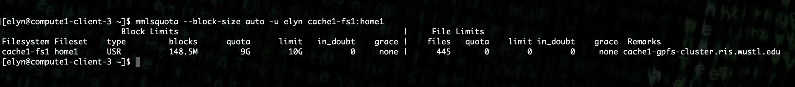
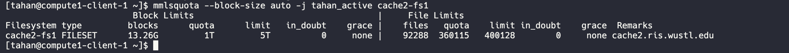

# Compute FAQ

## How do I get help with the RIS Compute Service?

The *RIS Service Desk* has a [section for the Compute Service](https://washu.atlassian.net/servicedesk/customer/portal/2/group/6/create/43)

## Where can I find RIS Compute Documentation?

The *RIS User Manual* has a [chapter for the Compute Service](https://confluence.ris.wustl.edu/display/RSUM/02%3A+RIS+Compute+Management)

## Where are the RIS computing services physically located?

The Research Datacenter is physically located at:
> 222 S Newstead Ave.
> St. Louis, MO 63110


You can take a [virtual tour of the data center](https://kuula.co/share/79Wh6/collection/7lcvK?fs=1&vr=1&sd=1&thumbs=1&chromeless=1&logo=1%22%3E%3C/iframe)

## How do I Obtain an account?

Accounts for RIS Compute Services use WUSTL Key credentials, so you must obtain one of those 
before you can get an account with RIS Compute Services:
   - [https://it.wustl.edu/home/how-to/wustl-connect/](https://it.wustl.edu/home/how-to/wustl-connect/)
   - *See this page* for help with WUSTL Keys.

## How do I change my password?

Since RIS Compute Services uses WUSTL Key credentials you must change your password for that. 
WashU IT has documentation on resetting WUSTL Key passwords:
   - [https://it.wustl.edu/items/how-do-i-change-my-wustl-key-password/](https://it.wustl.edu/items/how-do-i-change-my-wustl-key-password)

## How do I log into the Compute environment?

See our *Quick Start Guide* on how to get connected.

## How do I make it so I can log in without having to use my password?

We suggest you make use of SSH keys to log into the compute clients, see *SSH Key-Pair Setup*.

## How do I launch jobs in the HPC environment?

See our *Quick Start Guide* for submitting your first job. Further information can be found 
elsewhere in this documentation for more complex examples.

## How should I name my files and directories?

There is documentation on best practices for file naming available in our documentation. You can 
find that information at the following links.
    - *File Naming Best Practices*
    - *Naming and Storage*

## Is there a way to summarize usage statistics?

This is actively being developed.

## What does it mean to have a "Compute Condo(minium)"

- Faculty members may purchase dedicated hardware for their labs to form what we refer to as a “condominium”.
  In this model, a “condo” is formed out of a set of hardware that we put into a Host Group.
- Then we create a pair of Queues named after the Lab, eg labname and labname-interactive.
- Then we create an AD group named compute-labname and populate it with Users. That group then gets priority
  access to that lab.
- Please see the :ref:`Compute Recipes <ris-compute-recipes>` section for more examples and details.

## Are there general access computing resources?

Yes. The "general" and "interactive" job queues are serviced by a set of execution nodes in a *Host Group* named "general".

## What is the difference between the general and the general-interactive queues?

- The general queue runs batch jobs much like the traditional HPC setting. They run in the background in the queue system.
- The general queue also makes use of cache system, which you can learn more about *here.*
- Jobs in the general queue can run for up to 28 days.
- The general-interactive queue runs jobs interactively so that you can interact directly with them or watch a job.
- The general-interactive queue does not use the cache system and instead interfaces with the Storage Platform directly.
- Jobs in the general-interactive queue can run for up to 24 hours.
- Please see the *general queue policies* for more information.

## What does the Compute Service price include?

- Colocation facilities worthy of hosting production quality computing hardware, datacenter space
- Power and cooling of the physical space
- Physical security
- Identity Managment: User accounts, groups, access controls and permissions
- Execution nodes: Varying by CPU flavor, speed, RAM quantity, local hard drive space, etc.
- Networking: All of the above for networking systems
- Storage: All of the above for storage systems
- Data security: Operating system and software updates, incident response
- Integration: Interconnects that provide appropriate bandwidth and Input/Ouput operations per second
- Integration with Cloud Services
- Integration with storage tiers, tape libraries, tape robots, data movers
- Integration with data movement, specialized technologies like Globus
- Operations: Monitoring, alerting, event response
- Support: Help when things go wrong
- Compute job scheduling
- Software development, software artifact repositories
- Container management
- Professional staffing: Specialists in all of the above
- More...

## How much space is in my `$HOME` directory?

`$HOME` directories are limited to 10GB. If you wish to observe your quota, you can use the following command:
```
mmlsquota --block-size auto -u wustlkey rdcw-fs2:home1
```

Under the BLock Limits portion 'blocks' is how much of the 10Gb that you have consumed.

## Why is this limited to 10G? Can I have more?

- User `$HOME` directories are intended to allow space for users to make use of the compute cluster, with the
  knowledge that the Storage Cluster is where data and software will be stored. This is accessed via `/storage1`,
  and the Scratch Cluster is accessed via `/scratch1`.
- The `$HOME` directory is required for the Compute Platform(s) to function for users and software often rely on it.
- Policy dictates that you be limited to 10G of `$HOME` space.
- The `$HOME` directory is NOT backed up and important data should NOT be stored here. Anything you wish to be
  backed up should be placed in `/storage1`, this includes scripts.

## How do I see what is using up all of my `$HOME` space?

- You can use the following command to list out the top 10 (or any number if you replace the 10) files or
  directories using the most space in your `$HOME` directory.
- Make sure the following command is run from your `$HOME` directory.
```
du -hsx .[^.]* * 2>/dev/null | sort -rh | head -10
```
- Expected example output.
```
800M	.vscode-server
140M	.local
95M	work
68M	.cache
41M	.lsbatch
24M	.nv
21M	.matlab
20M	.npm
20M	.config
15M	ondemand
```

## Why am I getting a Disk I/O error?

- This error typically refers to the ability of the job to write a file to a directory.
- The most common source of the error is a user's `$HOME` directory being full.
- If you encounter this error, please follow the steps below.
    - Use the methods described in the *home directory space section* section to determine if the home directory
      is at cap.
    - Remove or move files from the home directory to reduce usage.
    - Attempt to run the job again.
    - If the problem persists, submit a ticket to the [RIS Service Desk.](https://ris.wustl.edu/support/service-desk/)

## How much space is in my Storage Allocation?

- The Compute Service is connected to the Storage Service via POSIX filesystem mounts.
   - The batch (execution) nodes and condos are connected via cache.
   - The client and interactive nodes are connected directly.
- The Storage Service provides the SMB interface at `smb://storage1.ris.wustl.edu/${STORAGE_ALLOCATION}`.
- The Compute Service provides a POSIX interface via the filesystem path `/storage1/fs1/${STORAGE_ALLOCATION}`.
- You can observe available space via SMB mounts with a `df` command on the mounting workstation, or by the
  `mmlsquota` command while logged into the compute system.
```
mmlsquota --block-size auto -j wustlkey_active rdcw-fs1
```


- Again, under the Block Limits section, the 'blocks' portion is how much you have consumed.
  The Compute Service uses a caching interface to access the data. Read more about how
  this affects usage and quota here: *cache interfaces*

## How do I share files in my storage with colleagues?

- You can request access be granted to your colleagues through our ticketing system.
    - [https://jira.wustl.edu/servicedesk/customer/portal/2/group/7](https://jira.wustl.edu/servicedesk/customer/portal/2/group/7)
- You can also use collections within Globus to share specific folders or files with
  colleagues. This method is the suggested method when it comes to colleagues outside
  of WashU. You can find more information about using this feature here:
    - *Globus Collections Documentation*

## What's the best way for me to transfer data?

- The first method we recommend is to use SMB mounts. You can find more information about
  connecting at the following link.
  - *SMB Connections*
- Our suggested method of transferring data if SMB is not an option is to make use of Globus.
  You can use Globus in multiple ways. There are links to our Globus documentation below.
    - *Globus*
    - *Globus CLI*
    - *Globus Connect Personal*

## How do I request more resources for my job?

- Requesting more resources for your job means using options that are part of the bsub
  command. You can find out more information about the bsub options at the following link.
    - *bsub Options Documentation*
- Be aware that if the software you use requires special options in order to use these
  resources, you will need to include those options in your software command as well.

## Does RIS offer Docker containers or a repository for them?

- RIS offers RIS hosted and controlled Docker images. You can find them *here.*
- RIS also offers a list of vetted applications where we do not control the Docker image
  nor host it. You can find that list *here.*
- You can request help building a Docker image if you are having trouble via our ticketing
  system.
- Software that is used frequently is taken into consideration when creating RIS hosted
  and controlled Docker images.
- We currently do not have a public repository for users to host their own images in.

## Why can't I connect to my noVNC image?

- The first reason this could be happening, is port conflicts.
    - If your job lands on a node that has a job already using the port you are attempting to, you will not be able to connect.
    - You can attempt to launch your job on a new node, or you can change the port you're using and launch the job again.
- The second reason this could be happening, is that some department based VPNs are not part of the trusted network that will allow this.
    - Please see our *`VPN information* for which VPNs we recommend.
- If you wish to avoid dealing with ports for GUI based software, you can check out what software we have available through Open on Demand.
    - *Open On Demand documentation*
- You can also use port fowarding to get around the second reason for being unable to connect.
    - *Port forwarding documentation*
      
## Software Debugging Policy

We strive to provide help with software debugging and support to the best of our
abilities and time. With that being said, there may be times when we cannot
solve an issue related to a specific piece of software or script that is not
supported by RIS. In those cases, we will attempt to provide a solution to the
problem, but we cannot guarantee that the solution will be successful. We
recommend reading *this section* for more help debugging your software as well 
as for guidance on software development best practices.
