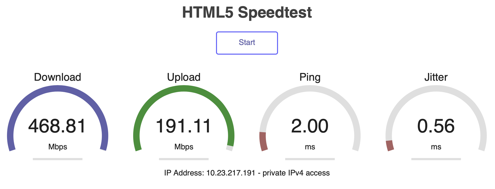

# Storage FAQ

## Troubleshooting your connection to Storage

If you are experiencing issues maintaining a stable connection to your storage allocation, please visit
the storage service troubleshooting page. *storage-troubleshooting*

## How do I know what Wash U Network I or my lab is on?

The RIS team supplies a *Speedtest* application that will report the IP address of
the browsing computer. Visit [the Speedtest URL](https://speedtest.ris.wustl.edu)

## What are the ways I can access data in the Storage Service?

At the time of this writing, you can access storage service Allocations via:
- SMB mounts from MacOS, Linux, and Windows.
- Globus Data Transfer endpoints.
- POSIX filesystem access within the RIS Compute Service (See *the RIS Compute Service*).

## What are the Storage and Archive policies?

These policies can be found [here.](../../polices/compute_user_agreement)
